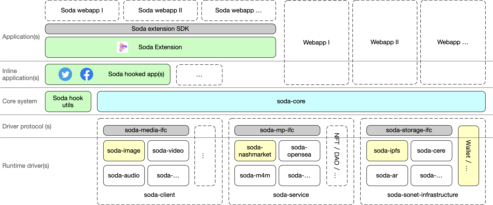

# Mono repo for Soda extension

Soda extension is a framework that can be divided into several submodules.

## soda-core

Soda-core is the core packageof Soda framework, which encapsulates Web3/Web2 features for new Web3 applications.

Engineers can use soda-core package to develop their own cross Web2/3 applications.

### soda-client

Soda is a framework that bridges Web2/Web3 resource with each other. Multiple web resources can be rendered into web client with soda-client packages. E.g., multple media types, audio, video, 3D view, game share.

### soda-service

Web2/Web3 services with similar features (SaaS) can be integrated into Soda core as soda-services. E.g., marketplaces.

### soda-sonet-infrastructure

Sonet middleware provides network infrastructure support for web applications, soda-sonet-infrastructure encapsulate sonet middleware services, help Soda applications to use Sonet middleware easily. E.g., Web2/Web3 storage services.

## soda-extension

Soda extension uses soda-core, provides self-sovereign data management and personal identity management. Applications can use soda-extension to make full use of user Web2/Web3 data.
